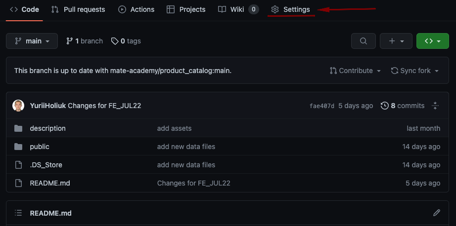
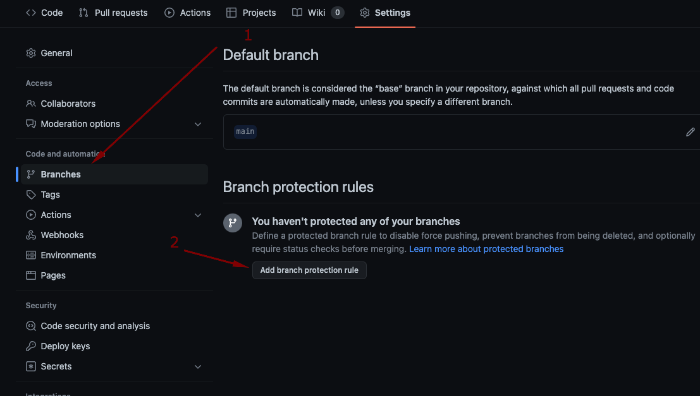
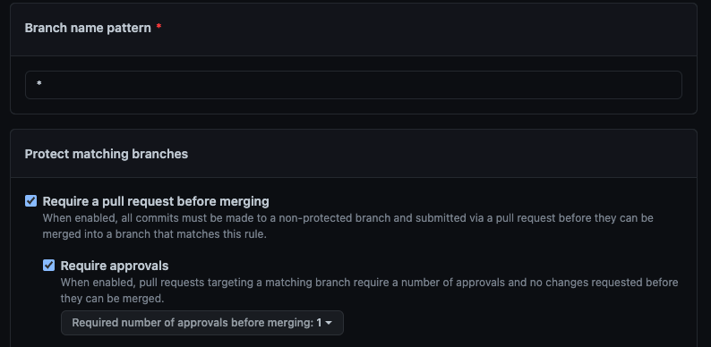

# Product catalog

Implement the catalog with a shopping cart and favorites page according to one of the next designs:
- [Original](https://www.figma.com/file/T5ttF21UnT6RRmCQQaZc6L/Phone-catalog-(V2)-Original)
- [Original Dark](https://www.figma.com/file/BUusqCIMAWALqfBahnyIiH/Phone-catalog-(V2)-Original-Dark)
- [Rounded Blue](https://www.figma.com/file/FRxncC4lfyhs6og1L6FGEU/Phone-catalog-(V2)-Rounded-Style-2?node-id=0%3A1)
- [Rounded Purple](https://www.figma.com/file/xMK2Dy0mfBbJJSNctmOuLW/Phone-catalog-(V2)-Rounded-Style-1?node-id=0%3A1)
- [Rounded Orange](https://www.figma.com/file/7JTa0q8n3dTSAyMNaA0u8o/Phone-catalog-(V2)-Rounded-Style-3?node-id=0%3A1)

## If you work in a team

1. Create an organization on Github
    
1. Choose a `Free` plan
1. Use a name like `fe-feb20-team0` (your group + your team name)
1. It should belong to your personal account
    
1. Add your teammates to the team by their usernames on Github
    

## Instructions
1. Create a new React project using [create-react-app](https://create-react-app.dev/docs/getting-started)
    - use an appropriate template if you are going to add `typescript` or `redux`;
1. Create a new Github repo with `product_catalog` name (or nay other you like)
   - if you work in a team the repo MUST belong to the organization;
    - configure `Branch protection rules` for the organization repository using the following tutorial:
      
      

        
Tutorial for branch protection rules

        
        Go to the repository settings
        STEP #1
        
        
        STEP #2
        
        
        Add the rule with only next settings
        STEP #3
        
    
        More information about all other settings at the [link](https://docs.github.com/en/repositories/configuring-branches-and-merges-in-your-repository/defining-the-mergeability-of-pull-requests/managing-a-branch-protection-rule)
      

      
1. Connect a repo to a folder with your React project (see the instructions on Github);
1. Setup deployment to Github Pages as described in the [React Deployment lesson](https://mate.academy/learn/react/deployment#/video)
    - (*) if you want to deploy your Express API to Heroku follow [this video](https://www.youtube.com/watch?v=HDYV4fYOeYY)
1. Setup Eslint as described [here](https://mate.academy/learn/nodejs/dev-environment-nodejs#/video/2300).
    - you may also want to setup Prettier, Husky, and Lint Staged (see the next videos in the lesson).
1. The `main` branch is a base for your feature PullRequests.
1. Merge PRs to `main` branch on github.

## How to develop a feature

1. `Pull` the latest `main`.
1. Create a `your-feature-name` branch and `push` it to Github.
1. Open a Pull Request (`PR`) from your branch to the `main`.
1. Write your code, save it and push it to Github.
1. Ask your teammate to review and approve if everything is OK.
1. If some fixes are required discuss the comments and repeat steps 5-7.
1. Mentors will review your codebase everyday, but not PRs.

## Data

1. You have `phones.json` and `phones/:phoneId.json` files in the `api` folder.
1. Images are inside `img/phones` folder grouped by phone models and colors.
1. Better to move images to the API side, but they can exist on a FE side too.
1. Each product has:
    - `id` is required to fetch product details;
    - `name` with a product name;
    - `image` with a link to the first image relative to a `public` folder;
    - `price` and `fullPrice` to show the discount;
    - `year` is used to sort by `Newest`;
    - `capacity` and `color` that can be choosen on product details page.

## App

1. Put components into an `src/components` folder.
    - each component should be a folder with `index.ts`, `ComponentName.tsx`, `ComponentName.module.scss` files.
    - use CSS modules.
    - keep `.module.scss` files together with their components.
1. Advanced project structure:
    - `src/modules` folder. Inside per page modules `HomePage`, `CartPage`, ect. and `shared` folder. with shared content between modules.
    - inside each module is own `components` folder with the structure described above. And optionaly other files/folders: `hoocs`, `constants` and so on.
3. Add the sticky header with a logo, navigation, favorites and cart.
4. The footer with the link to the Github repo and `Back to top` button.
    - the content should limited to the same width as the page content;
    - `Back to top` button should scroll to the top smoothly;
5. Add `NotFoundPage` containing text `Page not found` for all the unknown URLs.
6. All changes the hover effects should be smooth.
7. Scale all image links by 10% on hover.
8. Implement all form element and icons according to the UI Kit

## Product pages

There should be 3 separate pages `/phones`, `/tablets` and `/accessories`.

1. Each page loads the data of required `type`.
1. Add an `h1` with `Phones/Tablets/Accessories page` (choose required).
1. Add `ProductsList` component showing all the `products`.
1. Implement a `Loader` to show it while waiting for the data from server.
1. In case of loading error show the something went wrong message with a reload button.
1. If there are no products available show the `There are no phones/tablets/accessories yet` message (choose required).
1. Add a `<select>` with the `Newest`, `Alphabetically` and `Cheapest` options to sort products by `age`, `title` or `price` (after discount).
    - save the sort value in the URL `?sort=age` and apply it after the page reload;
1. Add `Pagination` buttons and `Items on page` select element with `4`, `8`, `16` and `all` options.
    - it should limit the products you show to the user;
    - save pagination params in the url `?page=2&perPage=8` (`page=1` and `perPage=all` are the default values and should not be added to the URL;
    - Hide pagination elements if they does not make sense;
    - You can use the logic explained in [the React Pagination task](https://github.com/mate-academy/react_pagination#react-pagination);

## Shopping Cart page

Create a Cart page with a list of `CartItem`s at `/cart`.
Each item should have an `id`, `quantity` and a `product`.
Use the React Context or Redux to store Items.

1. `Add to cart` button in the `ProductCard` should add a product to the `Cart`.
1. If the product is already in the `Cart` the button should say `Added to cart` and do nothing.
1. Add ability to remove items from the `Cart` with a `x` button next to a `CartItem`.
1. Add message `Your cart is empty` when there are no products in the `Cart`
1. Add ability to change the item quantity in the `Cart` with `-` and `+` buttons (it should be > 0).
1. Total amount and quantity should be calculated automatically.
1. Show the quantity at the `Cart` icon in the header.
1. Save the `Cart` to the `localSotrage` on each change and read it on page load.
1. `Checkout` button should show a modal dialog with the text `Checkout is not implemented yet. Do you wan't to clear the Cart?`:
    - clear the Cart if the user confirms the order;
    - keep the Cart items and close the confirmation on cancel;
    - use the `confirm` function if you don't have a better solution.

## Home page

Implement Home page at available at `/`.

1. `<h1>Product Catalog</h1>` should be visually hidden.
1. `PicturesSlider`:
    - find your own images to peronalize the App;
    - change pictures automatically every 5 seconds;
    - the next buttons should show the first image after the last one;
    - dashes at the botton should allow to choose exact picture.
1. `ProductsSlider` for `Hot prices` block:
    - the products with a discount starting from the biggest absolute value;
    - `<` and `>` buttons should scroll products.
1. `Shop by category` block with the links to `/phones`, `/tablets` and `/accessories`.
1. Add `Brand new` block using `ProductsSlider` with products without a discount starting from the most expensive.
  
## Product details page

Create `ProductDetailsPage` available at `/product/:productId`. 

1. `ProductCard` image and title should be links to the product details page.
1. Use `Loader` when fetching the product details.
1. Show the details on the page:
    - fix one `Available color` and on `Select capacity` value for now;
    - `About` section should contain just a description (without any subheaders);
    - Choose `Tech specs` you want to show.
1. Add ability to choose a picture
1. Implement `You may also like` block with products chosen randomly:
    - create `getSuggestedProducts` method fetching the suggested products.
1. Add `Back` button working the same way as a Browser `Back` button.
1. Add `Breadcrumbs` at the top with
    - a Home page link;
    - a category page link (`Phones`, `Tablets`, `Accessories`);
    - the name of the product (just a text).
1. Show `Product was not found` if there is no product with a given id on the server.

## Favorites page

Create `Favorites` page with a `ProductsList` showing favorite products at `/favorites`.

1. Add/remove a product to favorites by pressing a heart button in the `ProductCard` element.
1. The heart should be highlighted if the product is already added to the favorites.
1. Use React Context or Redux to store the favorites.
1. Show the number of favorites at the `Favorites` icon in the header.
1. Save favorites to `localStorage` on each change and load the on page load.

## (*) Advanced tasks

### Search

Show `input:search` in the header when a page contains a `ProductList` to search in.

1. Save the `Search` value in the URL as a `?query=value` to apply on page load
1. Show `There are no phones/tablets/accessories/products matching the query` instead of `ProductList` when needed.
1. Add `debounce` to the search field.

### Other
1. Implement your own API with Node.js and Express.
1. Use PostgreSQL DB.
1. Save Orders to the DB after checkout.
1. Show the list of orders with all the saved orders at `/orders`.
1. Create Order details page at `/orders/:orderId` with ability to edit or cancel an order.
1. Implement the login/register functionality and show the author's email of each order in the list.
1. Restrict order editing only to its author.
1. Deploy the App and the API with the DB to the [Heroku](https://heroku.com)
